# homework1

### 调查并记录实验环境的如下信息：当前 Linux 发行版基本信息;当前 Linux 内核版本信息
当前Linux发行版的基本信息

Ubuntu

    cat /etc/issue

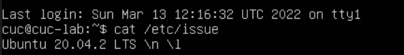
    
    cat /etc/os-release

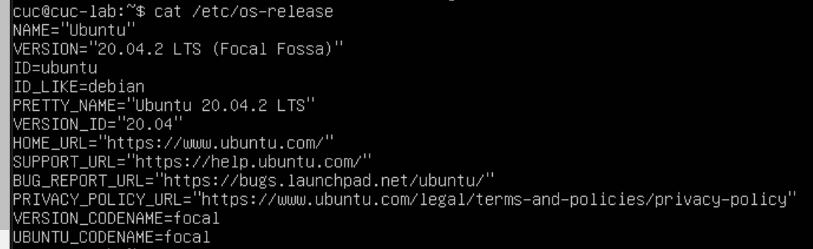

    lsb_release -a

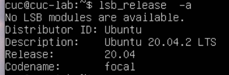

    less /etc/os-release

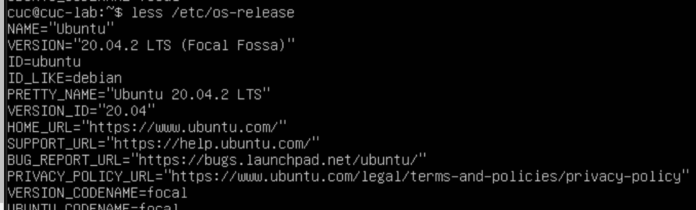

CentOS

    cat /etc/os-release

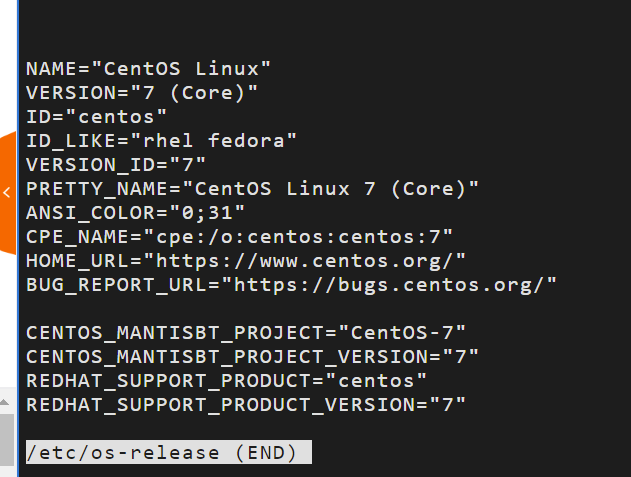

    lsb_release -a

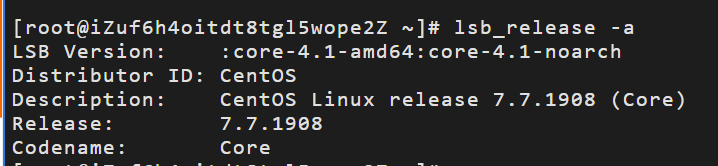
     
    cat /etc/os-release

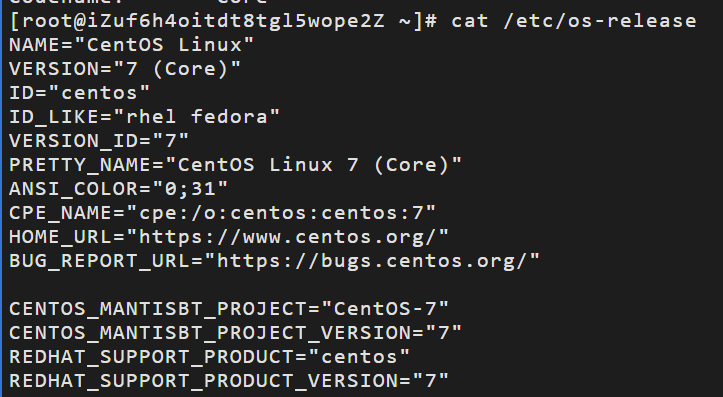

本地内核版本
Ubuntu

    uname -a

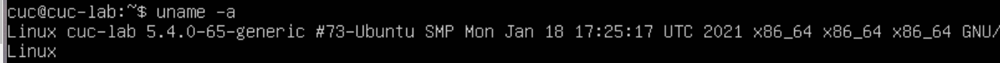

CentOs

    uname -a

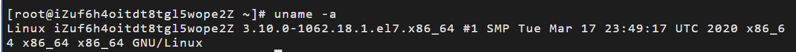

### Virtualbox 安装完 Ubuntu 之后新添加的网卡如何实现系统开机自动启用和自动获取 IP？

输入 `ifconfig -a` 查看所有网卡,
    
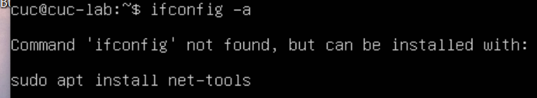

出现报错，后面附带解决办法
输入 `sudo apt install net-tools`

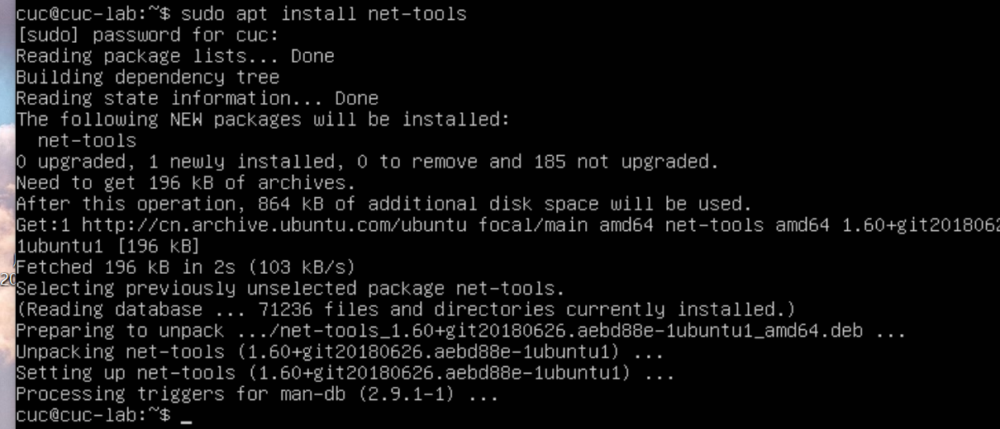

重新输入 `ifconfig -a` 可以看到所有网卡，但不一定所有网卡都在工作
   
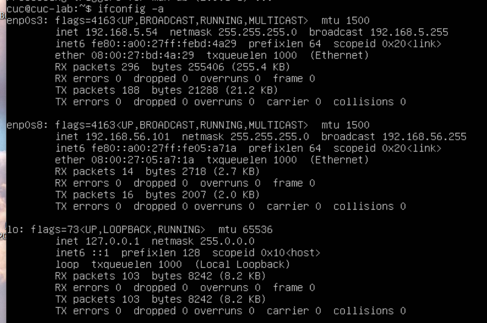
    
输入`ifconfig`,查看出现网卡的参数,可以看到两个网卡都已生效

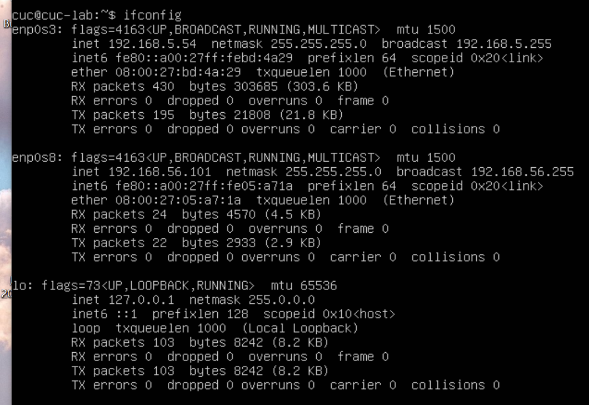

    ls /etc/netplan

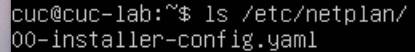

输入`sudo vim /etc/netplan/00-installer-config.yaml/`

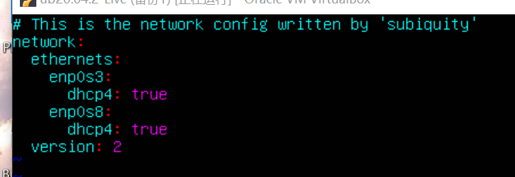

若在`ifconfig`时，发现有网卡没有生效，则通过`sudo vim /etc/netplan/00-installer-config.yaml`,手动加入没有出现的网卡，和dhcp4: true, 最后执行`sudo netplan apply`生效

[参考](https://ubuntu.com/server/docs/network-configuration "参考内容")

### 如何使用 scp 在「虚拟机和宿主机之间」、「本机和远程 Linux 系统之间」传输文件？

输入`scp help`查看命令格式
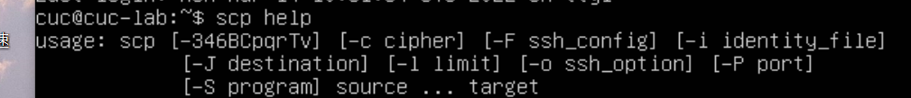

【虚拟机和宿主机之间】
虚拟机向宿主机传输文件：
首先在虚拟机中输入`touch one`在当前目录下创建一个文件.`cat one`
`echo "hello linux" > one`在one文件中写入内容“hello linux”
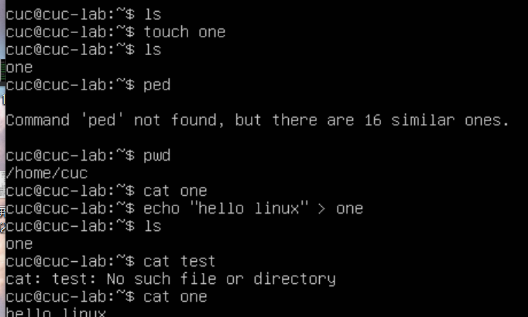
输入`scp cuc@192.168.5.54:/home/cuc/one ./`再输入密码，即可完成
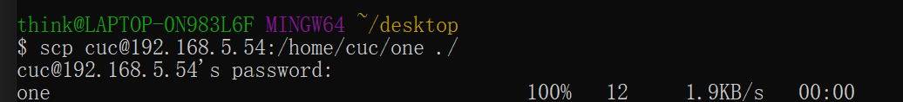

宿主机向虚拟机中传输文件：
首先在宿主机桌面新建一个test.txt文件，然后同理输入`scp test.txt cuc@192.168.5.54:/home/cuc/`
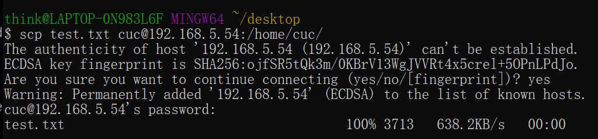
易错：记得先将目录转到desktop上，否则执行时会报错提示文件不存在

【本机和远程Linux系统之间的传输文件】
首先在CentOs中输入`touch test`在当前目录下创建一个文件.`cat test`
`echo "hello world" > test`在test文件中写入内容“hello world”
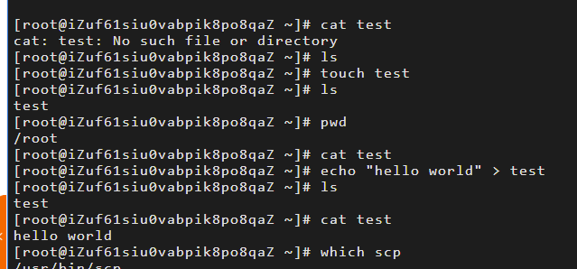
由远程系统到宿主机`scp root@101.133.140.57:/root/test ./`
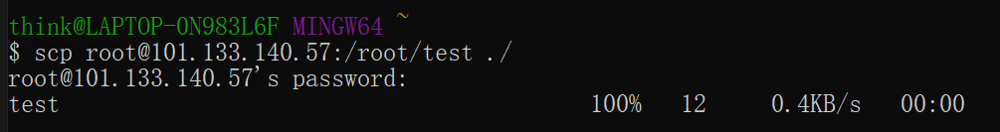
由宿主机到远程系统`scp test.txt root@101.133.140.57:/root/`
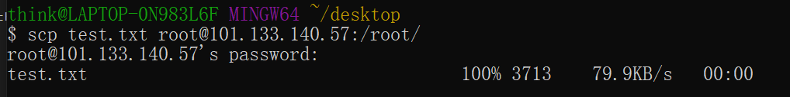

### 如何配置 SSH 免密登录？

`ssh-keygen`生成密钥对儿
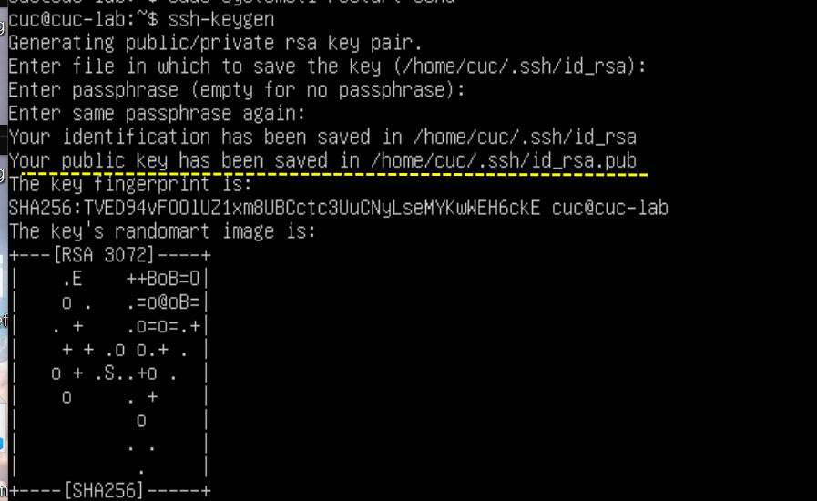
将生成的密钥对儿传入需要免密登录的主机
`ssh-copy-id -i /home/cuc/.ssh/id_rsa.pub cuc@192.168.5.54`
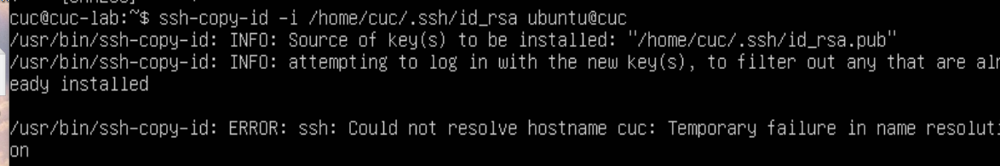
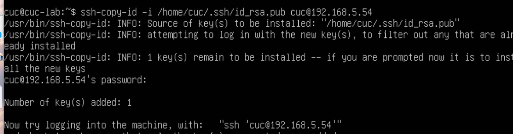
注：在这里路径可以通过上述生成密钥对儿时有一行得出。

且注意后面文件格式需添加，否则报错。
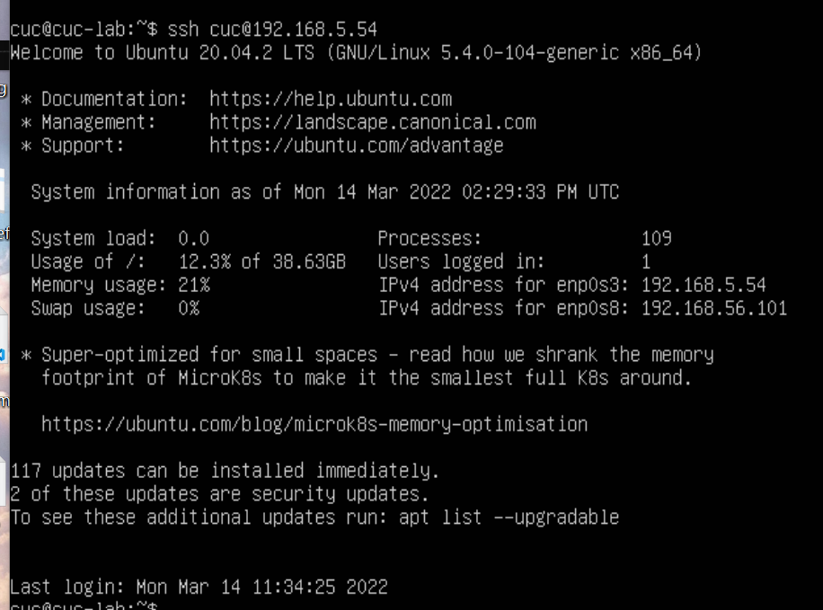

[参考链接]("https://ubuntu.com/server/docs/security-smart-cards-ssh")

